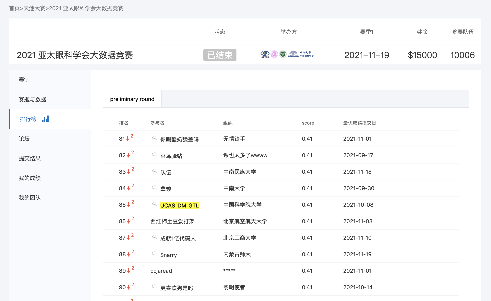
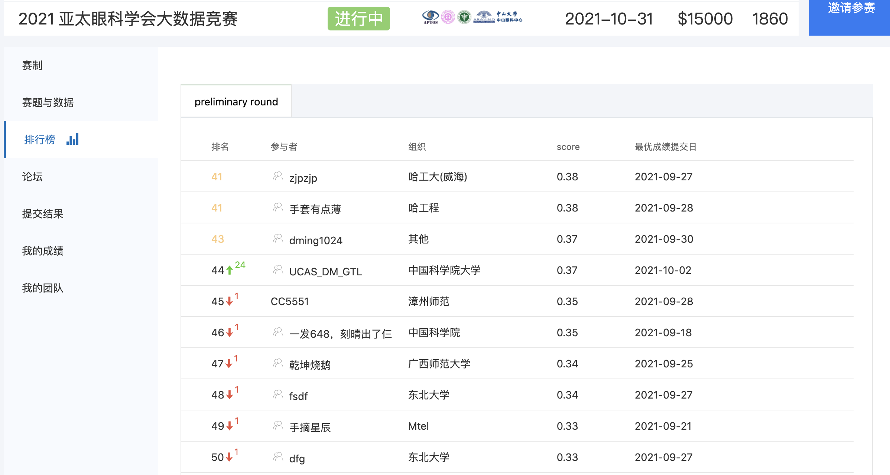
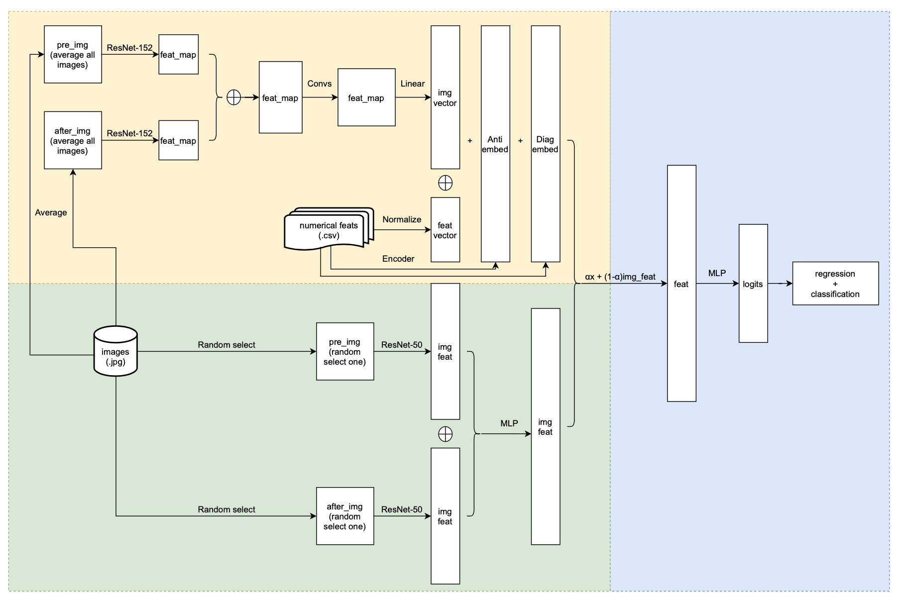

# 2021-APTOS-Big-Data-Challenge
[[2021 亚太眼科学会大数据竞赛](https://tianchi.aliyun.com/competition/entrance/531929/information)] | [队伍：UCAS_DM_GTL] | [[Leaderboard](https://tianchi.aliyun.com/competition/entrance/531929/rankingList)]

by Huixuan Chi, Linyan Huang and He Zhu

2021亚太眼科学会大数据竞赛是由[亚太眼科学会](https://asiateleophth.org/) (Asia Pacific Tele-Ophthalmology Society，APTOS)主办的全球人工智能挑战赛，其本主题是预测糖尿病性黄斑水肿 (DME) 患者的Anti-VEGF抗血管内皮生长因子(简称Anti-VEGF)治疗转归。同时，也是UCAS 2021秋季数据挖掘课程的大作业之一。

## 初赛结果：

+ rank: 85 / 10006
+ score: 0.4104





<!--  -->

|Date  | Score | 
|:-:|:-:|
| 2021-10-08 | 0.4104 | 
| 2021-10-07 | 0.3973 | 
| 2021-10-02 | 0.3807 | 
| 2021-10-02 | 0.3716 | 
| 2021-10-01 | 0.2853 | 

## Download dataset

v2版本数据集：[https://drive.google.com/u/0/uc?id=1Wc0CmqeZg_gJkiiqoB1EZT0S0seB1MF4&export=download](https://drive.google.com/u/0/uc?id=1Wc0CmqeZg_gJkiiqoB1EZT0S0seB1MF4&export=download)

数据集补充特征(pkl): [https://drive.google.com/u/0/uc?id=1h2aHyAxEaVbM23YGP6dr_1pdwWIbG2NT&export=download](https://drive.google.com/u/0/uc?id=1h2aHyAxEaVbM23YGP6dr_1pdwWIbG2NT&export=download)

~~数据集补充特征(pkl-152):~~[~~https://drive.google.com/u/0/uc?id=1C5_dRA1BmPOSjhlyrLxGO9LOhd5dXxao&export=download~~](https://drive.google.com/u/0/uc?id=1C5_dRA1BmPOSjhlyrLxGO9LOhd5dXxao&export=download)

原始仅切割的数据集split：[https://drive.google.com/u/0/uc?id=1i9tnBbfM3tkO5GyMtytsZcUIxU1Gyt0W&export=download](https://drive.google.com/u/0/uc?id=1i9tnBbfM3tkO5GyMtytsZcUIxU1Gyt0W&export=download)

~~v1版本数据集（已弃用）：~~[~~https://drive.google.com/file/d/1bx3x2dchtwgp-pBAqp0LzacLxY0sB0Gr/view?usp=sharing~~](https://drive.google.com/file/d/1bx3x2dchtwgp-pBAqp0LzacLxY0sB0Gr/view?usp=sharing) 

使用：下载并解压之后，放到`./dataset`（新建一个目录，和README同一级）。详细情况可以参见文末的目录树。

**ResNet预训练模型下载**
```bash
cd data/
# download ResNet-50
wget https://download.pytorch.org/models/resnet50-19c8e357.pth
# download ResNet-152 
wget https://download.pytorch.org/models/resnet152-b121ed2d.pth
```


## Branch Usage
baseline: `tianchi_v4`

[《git的一些使用心得》](https://blog.csdn.net/weixin_41650348/article/details/120468950?spm=1001.2014.3001.5501)

```bash
git clone git@github.com:ytchx1999/UCAS_DM_GTL_Tianchi.git
# create and checkout the branch
git checkout -b tianchi_v4
# or only checkout the branch
git checkout tianchi_v4
git checkout main
# pull from tianchi_v4 branch
git pull origin tianchi_v4:tianchi_v4

git add ...
git commit ...
git push -u origin tianchi_v4:tianchi_v4
```

## Environment
```bash
torch == 1.6.0
pandas == 1.2.0
pickle == 0.7.5
wget == 3.2
torchsummary == 1.5.1
opencv == 4.5.3
PIL == 8.1.0
seaborn == 0.11.2
```

## Experiment Setup
Run corr analysis.
```bash
cd src/utils
python corr_csv.py
```

Run model.
```bash
cd src/utils
# processing .csv
python preprocess_csv.py
# load data
cd ..
python main.py
# or run in background
nohup python main.py > ../outputs/result.log 2>&1 &
# check result
tail -f ../outputs/result.log
```

## Corr Analysis


```bash
Pos_Corr (r>0.6)                      
 [('preVA', 'VA'),                     
  ('preIRF', 'IRF'),                   
  ('prePED', 'PED'),                   
  ('preHRF', 'HRF'),                   
  ('VA', 'preVA'),                     
  ('IRF', 'preIRF'),                   
  ('PED', 'prePED'),                   
  ('HRF', 'preHRF')]                   
                                        
Pos_Corr (r<-0.4)                     
 [('diagnosis', 'preSRF'),             
  ('diagnosis', 'prePED'),             
  ('diagnosis', 'continue injection'), 
  ('diagnosis', 'PED'),                
  ('preSRF', 'diagnosis'),             
  ('prePED', 'diagnosis'),             
  ('continue injection', 'diagnosis'), 
  ('PED', 'diagnosis')]                
```


## Baseline模型结构




如图所示，模型（`model.py`）总共分为三个部分：黄色区域代表的上游主网络部分、绿色区域代表的上游辅助网络部分以及蓝色区域代表的下游网络部分。

## Tricks
+ 图片特征增强：对训练集图片进行随机裁剪和翻转，测试集图片保持不变
+ 学习率调整：每10个epoch，学习率衰减0.1
+ 舍弃无用的特征属性（gender、age）
+ 对整形离散特征（diagnosis、anti-VEGF）进行encoding，得到低维的embedding 
+ 预训练模型Resnet并冻结卷积层参数进行Fintune

## 不足

本次比赛基本达到了目标，仅使用最传统的ResNet模型进行模型搭建和设计，就成功进入了复赛。虽然如此，仍然有很多的不足之处：

+ 没有kfold cross validation和ensemble方法
+ 没有用到医学成像以及图像分割的domain knowledge和SOTA


## Directory Structure

```bash
.
├── LICENSE
├── README.md
├── data
│   ├── APTOS\ Big\ Data\ Competition\ Preliminary\ Dataset.rtf
│   ├── Flowchart.png
│   ├── PreliminaryValidationSet_Info.csv
│   ├── TrainingAnnotation.csv
│   ├── data_train.ipynb
│   ├── resnet18-5c106cde.pth
│   ├── submit.csv
│   ├── test_data.pk
│   ├── train_data.pk
│   └── tree.txt
├── dataset
|   ├── split
│   ├── mix_train
│   │   ├── 0000-0000
│   │   │   ├── 0000-0000L_1.jpg
│   │   │   ├── 0000-0000L_2.jpg
│   │   │   ├── ...
│   │   └── ...
│   |── mix_test
|   ├── pkl_train
|   └── pkl_test 
└── src
    ├── __init__.py
    ├── main.py
    ├── models
    │   ├── __init__.py
    │   └── model.py
    └── utils
        ├── __init__.py
        ├── corr_csv.py
        ├── dataset.py
        ├── mix_images.py
        ├── preprocess_csv.py
        ├── transfer_img.py
        └── preprocess_img.py
```