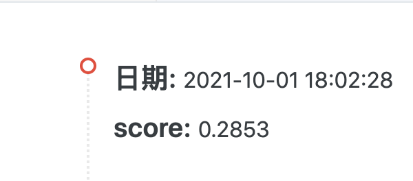
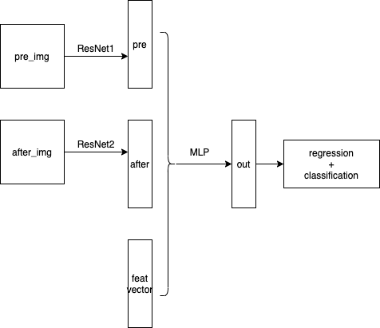
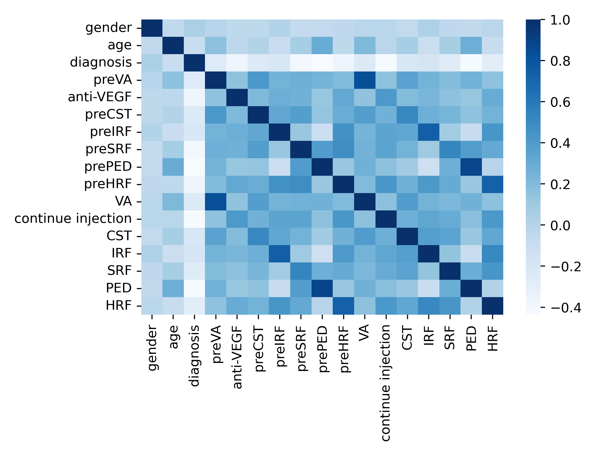

# UCAS_DM_GTL_Tianchi
[[2021 亚太眼科学会大数据竞赛](https://tianchi.aliyun.com/competition/entrance/531929/information)] | [队伍：UCAS_DM_GTL]

## Download dataset
v2版本数据集：[https://drive.google.com/file/d/1Wc0CmqeZg_gJkiiqoB1EZT0S0seB1MF4/view?usp=sharing](https://drive.google.com/file/d/1Wc0CmqeZg_gJkiiqoB1EZT0S0seB1MF4/view?usp=sharing)

v1版本数据集（已弃用）：[~~https://drive.google.com/file/d/1bx3x2dchtwgp-pBAqp0LzacLxY0sB0Gr/view?usp=sharing~~](https://drive.google.com/file/d/1bx3x2dchtwgp-pBAqp0LzacLxY0sB0Gr/view?usp=sharing) 

使用：下载并解压之后，放到`./dataset`（新建一个目录，和README同一级）。详细情况可以参见文末的目录树。

## Result


## Branch Usage
baseline: `tianchi_v2`

[《git的一些使用心得》](https://blog.csdn.net/weixin_41650348/article/details/120468950?spm=1001.2014.3001.5501)

```bash
git clone git@github.com:ytchx1999/UCAS_DM_GTL_Tianchi.git
# create and checkout the branch
git checkout -b tianchi_v2
# or only checkout the branch
git checkout tianchi_v2
git checkout main
# pull from tianchi_v2 branch
git pull origin tianchi_v2:tianchi_v2

git add ...
git commit ...
git push -u origin tianchi_v2:tianchi_v2
```

## Environment
```bash
torch == 1.6.0
pandas == 1.2.0
pickle == 0.7.5
wget == 3.2
torchsummary == 1.5.1
opencv == 4.5.3
PIL == 8.1.0
seaborn == 0.11.2
```

## Experiment Setup
Run corr analysis.
```bash
cd src/utils
python corr_csv.py
```

Run model.
```bash
cd src/utils
# processing .csv
python preprocess_csv.py
# load data
cd ..
python main.py
```

## Baseline模型结构



## Corr Analysis



```bash
Pos_Corr (r>0.6)                      
 [('preVA', 'VA'),                     
  ('preIRF', 'IRF'),                   
  ('prePED', 'PED'),                   
  ('preHRF', 'HRF'),                   
  ('VA', 'preVA'),                     
  ('IRF', 'preIRF'),                   
  ('PED', 'prePED'),                   
  ('HRF', 'preHRF')]                   
                                        
Pos_Corr (r<-0.4)                     
 [('diagnosis', 'preSRF'),             
  ('diagnosis', 'prePED'),             
  ('diagnosis', 'continue injection'), 
  ('diagnosis', 'PED'),                
  ('preSRF', 'diagnosis'),             
  ('prePED', 'diagnosis'),             
  ('continue injection', 'diagnosis'), 
  ('PED', 'diagnosis')]                
```

## 一个简单的想法（不一定对）——chx
[Process-on Flowchart](https://www.processon.com/view/link/613c1907e0b34d41bb4754f5)

## First communication：

图片处理：（huanglinyan）

[网上一个人写的思路，仅供参考。](https://tianchi-public.oss-cn-hangzhou.aliyuncs.com/public/files/forum/16312381041561645%E8%A7%A3%E9%A2%98%E6%80%9D%E8%B7%AF.pdf)

1. 将所需图片进行裁剪，获取有用的特征（同一个病例左右眼分开，治疗前后分开，命名样例：0000-0000L_1000_cut_1.jpg、0000-0000L_1000_cut_2.jpg，注意一下在遍历文件夹时，需要注意匹配前面的字段，后面的lr可能匹配不上)
2. 将裁剪下来的图片合并为一张图片（同一个病例左右眼分开，治疗前后分开，分别相加），图片保存到当前目录下，命名样例0000-0000L_1.jpg 或 0000-0000L_2.jpg（1代表治疗前，2代表治疗后）

csv文件处理：（chihuixuan）

1. 去掉nan值所在的一个样本
2. 获取训练测试的输入数据以及label，一行样本对应处理后的一个文件名，治疗前后分开，行数扩大为原来的两倍（训练测试分别做一个txt文件）

一些想法（zhuhe）

感觉这个主要难度都在图像处理和专家知识上。

目前有两个想法：
1. 需要先了解清楚CST，IRF这些属性在患者图像中是怎么体现的，大概在图像的哪些部分可以帮助进行判别，这样方便下一步设计图像算法，进行二分类；
2. 另一方面可以做一些相关性分析的算法，判断各个属性对VA的值的影响，单独设计一个模型预测VA的变化。

## Directory Structure

```bash
.
├── LICENSE
├── README.md
├── data
│   ├── APTOS\ Big\ Data\ Competition\ Preliminary\ Dataset.rtf
│   ├── Flowchart.png
│   ├── PreliminaryValidationSet_Info.csv
│   ├── TrainingAnnotation.csv
│   ├── data_train.ipynb
│   ├── resnet18-5c106cde.pth
│   ├── submit.csv
│   ├── test_data.pk
│   ├── train_data.pk
│   └── tree.txt
├── dataset
│   ├── mix_train
│   │   ├── 0000-0000
│   │   │   ├── 0000-0000L_1.jpg
│   │   │   ├── 0000-0000L_2.jpg
│   │   │   ├── ...
│   │   └── ...
│   └── mix_test
└── src
    ├── __init__.py
    ├── main.py
    ├── models
    │   ├── __init__.py
    │   └── model.py
    └── utils
        ├── __init__.py
        ├── corr_csv.py
        ├── dataset.py
        ├── mix_images.py
        ├── preprocess_csv.py
        └── preprocess_img.py
```